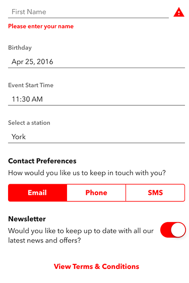

# TheDistanceForms

TheDistanceForms is an iOS framework for creating flexible forms as generic collections of user input elements.

## Features

- [x] Multiple user input types
	- Text (Single / Multiline)
	- Boolean
    - Date & Times
    - Selection
    - Media (Image / Video)
- [x] Prebuilt validation types
	- Empty entry
	- Email
	- Postcode
	- Regex
- [x] Custom generic validation
- [x] Customisable layout and styling
- [x] JSON form creation

## Component Libraries

In order to keep this library focussed, additional functionality is available in other libraries available from The Distance.

* [TheDistanceCore]()
* [KeyboardResponder]()
* [SelectionViewController]()

## Requirements

* iOS 8.0+
* Xcode 7.3+

## Installation

### Carthage

[Carthage](https://github.com/Carthage/Carthage) is a decentralized dependency manager that builds your dependencies and provides you with binary frameworks.

Carthage is the recommended way of integrating this into your project.

## Usage

### Quick Start

The simplest way to get started is to define a [JSON Form](#json-form-set-up). Once you have defined your form you create a `Form` object from a [SwiftyJSON](https://github.com/SwiftyJSON/SwiftyJSON) representation of your data.

    guard let data = NSData(contentsOfURL: jsonURL),
        let form = Form(definition: JSON(data:data))
        else {
            return nil
    }

This holds references to all of the views and question objects in your form. `FormContainer` is a protocol providing default functionality for setting up your form, keyboard input and view hierarchy.

Create a `UIViewController` conforming to `FormContainer` and you can set up your form as follows:

	var form:Form?
	var keyboardResponder:KeyboardResponder?
	
	override func viewDidLoad() {
        super.viewDidLoad()
                
        guard let jsonURL = NSBundle.mainBundle().URLForResource("Form", withExtension: "json"),
            let form = addFormFromURL(jsonURL, toContainerView: scrollView, withInsets: UIEdgeInsetsMake(16.0, 16.0, 16.0, 8.0))
            else { return }
        
        self.form = form
        keyboardResponder = setUpKeyboardResponder(onForm: form, withScrollView: scroll)
    }

`addFormFromURL(_:toContainerView:withInsets)` creates the form and adds all the questions in a vertical stack to the `containerView` parameter, in this case a `UIScrollView` instance. This is the default UI:

`setUpKeyboardResponder(onForm:withScrollView:)` configures a [KeyboardResponder]() object to manage user navigation between fields.

*The repo project contains a Demo app with examples of a basic JSON form and a customised form.*

### Validation

Form validation is performed on a per question basis, and runs when that question field resigns first responder status or when `form.validateForm()` or `form.validateValues()` is called, whichever is first. Validation specified in JSON is limited, however if specified in code any validation can be performed using a  Validation type object:

	public struct Validation<Type> { ... }

Convenience initialisers are available for:

* NonEmpty strings
* String Regex
* Email
* Postcode
* Telephone
* Generic Number

Validation elements can also be composed e.g. Telephone OR Email Address.

### Getting Answers

The simplest way to get answers from a form is to add a submit button. The default implementation of `FormContainer` adds a target to each `Button` which will call through to `buttonTappedForQuestion(_:)`. You can use the `question.key` to determine which of the buttons in your form has been tapped, and thus respond to your submit button.

`form.validateForm()` can be used to get an array of `ValidationResult` for each question. You can respond to this to show alerts or if the total result is `.Valid` get submit the user's response to a server.

`form.answersJSON()` returns a `SwiftyJSON` dictionary of the question `key` and the user's response. If there is no response, `null` is added to the dictionary for that `key`.

	{
	  "birthday" : null,
  	  "first_name" : "Josh",
 	  "station" : "London King's Cross",
      "newsletter" : true,
      "contact" : 1,
      "event_start" : "2016-04-25 15:35:03 +0000"
	}

### JSON Form Set Up

The simplest way to get started is to define a JSON form. The full schema is defined in the repo (/Documentation/Schema.json) and can be used for validation on sites such as [JSON Schema Lint](http://jsonschemalint.com/draft4/#). A Form has a `title` and `questions` array, and should be the root object of the JSON.

	{
		"title": "New Booking",
		"questions": [
			...
		]
	}

Each question requires a `key` and a `question_type` and can optionally take a `validation`. Each type has various properties for how that question is customised.

#### Free Text Entry

Free text entry can be added using `TextSingle` and `TextMultiline`. `TextSingle` is backed by a `TextFieldStack`, `TextMultiline` is backed by a `TextViewStack`. They add error showing a placeholder functionality to `UITextField` and `UITextView` respectively.

A simple notes text field could be represented by:

    {
        "key": "notes",
        "question_type": "TextMultiline",
        "prompt": "Notes"
    }

This will add a text view with placeholder text "Notes" to your form.

More configuration is available, a title text field with validation and extra capitalisation could be represented by:

    {
        "key": "booking_title",
        "question_type": "TextSingle",
        "prompt": "Title",
        "capitalization": "Words",
        "validation": {
            "type": "NotEmpty",
            "value_type": "String",
            "message": "Please enter a title for your booking."
        }
    } 

Full details can be found in the schema space

#### Choices

Simple selection can be added backed by either a `UISegmentedControl` or a `UIPickerView`. A segmented choice returns its values for validation as indexes in the array of choices. The only validation specifiable in the form is `NotEmpty`. As there is no text view for a prompt, a segmented choice has a title and a subtitle.

    {
        "key": "contact",
        "question_type": "ChoiceSegments",
        "title": "Contact Preferences",
        "subtitle": "How would you like us to keep in touch with you?",
        "choices":[
            "Email",
            "Phone",
            "SMS"
        ],
        "validation": {
            "type": "NotEmpty",
            "value_type": "Number",
            "message": "You must select a preference"
        }
    }

A dropdown choice displays its choices in a `UIPickerView` and can therefore be used for longer lists of choices. Validation is using a String and so more validation types are available.

    {
        "key": "station",
        "question_type": "ChoiceDropdown",
        "prompt": "Select a station",
        "choices":[
            "London King's Cross",
            "Peterborough",
            "York",
            "Darlington",
            "Durham",
            "Newcastle",
            "Edinburgh Weverley"
        ],
        "validation": {
            "type": "NotEmpty",
            "value_type": "String",
            "message": "You must select a station"
        }
    }

#### Boolean
        
Simple Yes/No questions can be added using a switch. These could be "Opt in to our Newsletter" or you can add validation to ensure the user has agreed to Terms & Conditions.

    {
        "key": "newsletter",
        "question_type": "Boolean",
        "title": "Newsletter",
        "subtitle": "Would you like to keep up to date with all our latest news and offers?",
        "default": false
    }
    

    
#### Buttons

Buttons can be added to a form using the `Button` question type.

    {
        "key": "view_terms",
        "question_type": "Button",
        "title": "View Terms & Conditions"
    }

        
## Customising A Form

Whilst JSON is convenient it cannot express all the functionality of the framework. You can create a form initially from JSON using a subclass of `Form` and add extra functionality. This enables custom UI, logic, layout and validations.

### Customising UI

The UI is created from `FormQuestion.init(json:)`. For each question in the JSON definition, depending on the `question_type` one of `textSingleViewForQuestion(_:)` and other `...ViewForQuestion(_:)` methods are called. Where necessary these call `newTextSingleView()` and other `new...View()` methods to instantiate the `UIView`s used to display each question.

To customise the UI, subclass `FormQuestion` and override these methods. When the form is created, specify a `questionType` as an initialiser parameter, or as a parameter in the `FormContainer` creator method.

	class MyFormQuestion {
	
		override func newTextSingleView() -> TextFieldStack {
	
			let stack = super.newTextSingleView
			
			stack.textField.font = ...
			stack.errorLabel.textColor = ...
			
			return stack
		}
	
	}
	
When creating your form
	
	self.form = Form(definition: JSON(data:data), questionType: MyFormQuestion.self)

#### ThemeKit for Styling

As well as subclassing `FormQuestion` and configuring views in `new...View()` methods,  TheDistanceForms contains a [ThemeKit](https://github.com/joshc89/ThemeKit) compatible framework (TheDistanceFormsThemed) that adds `TKTextField`, `TKTextView` and other ThemeKit subclasses for UIKit components. It also adds a `TKFormQuestion` type that overrides `new...View()` to return ThemeKit stacks. You can further subclass this to change the styles of the components if desired.

The test form created with a simple Theme of red Accent colour and Avenir Next font styles is shown below.

	let form = addFormFromURL(jsonURL, questionType: TKFormQuestion.self, toContainerView: scroll, withInsets: UIEdgeInsetsMake(16.0, 16.0, 16.0, 8.0))
	

### Custom Layout

*Override the default layout and move away from all data input as tables.*

Custom layout can be achieved by creating a new stack instead of using the `formView` variable. Views can be accessed using the `elementForKey(_:)` methods from `KeyedView`. The keys are the question keys, the views are the UIView's of the `QuestionView`. In this way a custom view can stack views differently to enable side by side layout of fields such as start and end time, or title, first and last names.

The demo application contains an `EventForm.json` definition. This contains a `TextSingle`, two `DateTime` and a `TextMultiline` field. `BookingForm`. To lay the date fields side by side we use a subclass of `Form`, called `EventForm`, overriding the `createFormView(_:)` method.

	class EventForm: Form {
    
    	override func createFormView() -> StackView {
        
        	// 1. Test Views exist
    	    guard let titleView = self.viewKeys["event_title"],
     	       let startView = self.viewKeys["start_date"],
    	        let endView = self.viewKeys["end_date"],
    	        let notesView = self.viewKeys["notes"]
    	        else { return super.createFormView() }
        
        	// 2. Align the dates horizontally
    	    var dateStack = CreateStackView([startView, endView])
    	    dateStack.spacing = 8.0
    	    dateStack.stackDistribution = .FillEqually
        
        	// 3. Stack all components vertically
   	  	    var stack = CreateStackView([titleView, dateStack.view, notesView])
   	        stack.axis = .Vertical
      	    stack.spacing = 16.0
        
        	return stack
    	}
    
	}
	
We use [StackView](https://bitbucket.org/joshcampion89/StackView) to create a UIStackView or [TZStackView](https://github.com/tomvanzummeren/TZStackView/) depending on whether you are running on iOS 9 or iOS 8.

This version of the form can then be specified over the default form when we call the `FormContainer` method to add the Form to our view hierarchy.

	guard let jsonURL = NSBundle.mainBundle().URLForResource("EventForm", withExtension: "json"),
            let form = addFormFromURL(jsonURL, ofType: EventForm.self, toContainerView: formContainer, withInsets: UIEdgeInsetsZero)
            else { return }
            

The form is also added to a form container rather than a root view, allowing the form to sit as a small part of the view hierarchy. Providing the KeyboardResponder is set up as before, navigation still works as expected. Much more complex layouts can be created in this way.

### Custom Logic

*Tracking changes to enforce conditions on date selection.*

You can further extend your Form subclass to add logic that you cannot specify in the JSON format. In the event example we can constrain the dates to be in the future and ensure the end date is after the start date.

	private(set) var startObserver:ObjectObserver!
    
    required init?(definition: JSON, questionType: FormQuestion.Type) {
        super.init(definition: definition, questionType: questionType)
        
        // 1. Get the date controllers
        guard let startView = questionForKey("start_date")?.questionView,
            case let .DateTime(startStack, startController) = startView,
            let endView = questionForKey("end_date")?.questionView,
            case let .DateTime(_, endController) = endView
            else {
                return nil
        }
        
        // 2. Set the minimum dates to now
        startController.datePicker.minimumDate = NSDate()
        endController.datePicker.minimumDate = NSDate()
        
        // 3. When the start date changes, update the end date to be later with a minimum duration
        startObserver = ObjectObserver(keypath: "text", object: startStack.textField, completion: { (keypath, object, change) in
            endController.datePicker.minimumDate = startController.datePicker.date.dateByAddingTimeInterval(30 * 60)
        })
    }

In this way we can build up complex relations between the 

### Custom Validation

*Implement validation based on other user entry*

The Register example is a typical register form including name, email address and password. Notice the extra customisation for the email and password fields. The password field also enforces a given format for the password using Regular Expressions.

        {
            "key": "password",
            "question_type": "TextSingle",
            "prompt": "Password",
            "capitalization": ".None",
            "auto_correction": false,
            "secure_text_entry": true,
            "validation": {
                "type": "Regex",
                "value_type": "String",
                "regex": "^[a-zA-Z0-9]{6,}$",
                "message": "Please enter a password at least 6 characters long containing only letters and numbers."
            }
        }
    
What we cannot specify in JSON is that the confirm field matches. We can do that in code by override the form initialiser and manually creating a `Validation<String>` object.

    required init?(definition: JSON, questionType: FormQuestion.Type) {
        super.init(definition: definition, questionType: questionType)
        
        guard let passwordView = questionForKey("password")?.questionView,
            case let .TextSingle(passwordStack) = passwordView,
            let confirmView = questionForKey("confirm_password")?.questionView,
            case let .TextSingle(confirmStack) = confirmView
            else {
                return nil
        }
        
        confirmStack.validation = Validation(message: "Your passwords must match.", validation: { (value) -> Bool in
            return value == passwordStack.text
        })
    }

### Helper Classes

To facilitate form creation multiple classes have been added to complement standard UIKit elements.

#### Error Stack

A stack of UI components that can display placeholders, titles and error messages using simple properties.

* *See Also: `TextFieldStack`, `TextViewStack`, `SwitchStack`*

#### UIPicker & UIDatePicker convenience

A controller `NSObject` subclass containing boilerplate code to be a delegate for a `UIPickerView` or `UIDatePickerView`. This simplifies the set up of a `UITextField` to be used for date and choice selection.

## Communication

- If you have **found a bug**, open an issue.
- If you have **a feature request**, open an issue.
- If you **want to contribute**, submit a pull request.
- If you'd like to **ask a general question**, email us on <hello+thedistanceforms@thedistance.co.uk>.

